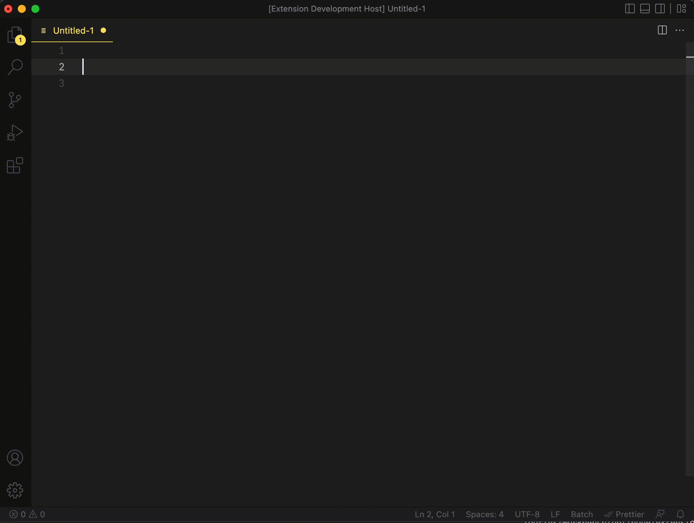
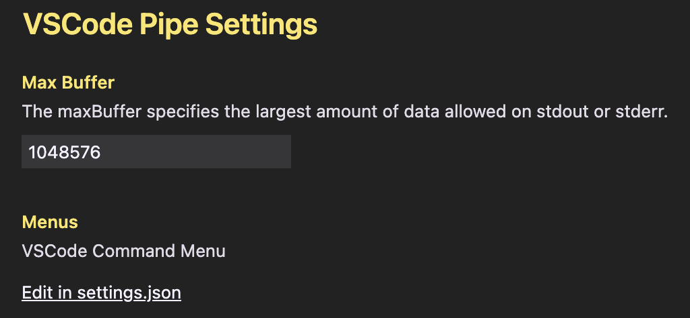

# VSCode Pipe README

VSCode Pipe enables pipelining in Visual Studio Code. It executes commands with the selected part on the editor as STDIN and replaces it with the STDOUT of the execution result. The output on the STDERR is displayed as an informational message.
You can execute any command you like by entering the command. Since it is tedious to type the same command every time, you can register commands in advance and select them from the menu. Of course, you can also execute programs created in your favorite language such as Python or Ruby.

## Features

In the following capture, this is what is being executed.

1. execute the ls command registered in the menu.
2. Count the number of lines in the result of the ls command using the wc command.
3. After undoing the result, use grep command to extract only the lines that contain Map.



## Extension Settings

The following settings can be added to setting.json



- Maximum buffer size
- menu

  Specify the name of the command in label; describe the command to be executed in description.

  ```json
  "vscodePipe.menus": [
      {
        "label": "Upper Case",
        "description": "tr '[:lower:]' '[:upper:]' "
      },
      {
        "label": "ls",
        "description": "ls -l"
      },
      {
        "label": "hostname",
        "description": "hostname"
      }
  ]
  ```

## Release Notes

### 1.0.0

Initial release.
