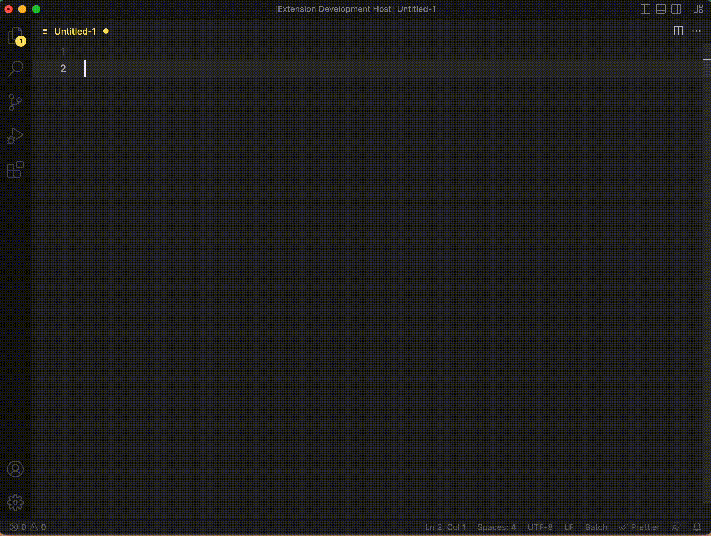

# VSCode Pipe README

VSCode Pipe allows you to execute commands from Visual Studio Code. The selection made in the editor is passed to the command as stdin. The selected part is replaced by the result of the command execution output to the stdout. Any output to stderr output is displayed as an informational message.
For example, if you select multiple lines in the editor screen and execute the sort command, the text will be replaced with the sorted results. if you execute grep, only the lines that match the search results will be displayed.
You can also run your own programs. The program must be made to read data from stdin and output to stdout.

The capture below is an example of execution. The following operations are performed.

1. Execute the ls command registered in the menu.
2. Convert the result of the ls command to uppercase.
3. Enter a number on the screen and execute sort | uniq.
4. Execute wc -l command to display the number of lines in the result of 4.



## Features

- How to start
  Select "VSCode Pipe" in the command palette.
  You can also use the following shortcut
  MAC: Command + Option + p
  Windows: Ctrl + Alt + p

- Select a command from the menu and execute it
  Frequently used commands can be registered in the menu, and can be added to the menu with "vscodePipe.menus" in the setting.json file.

- Executing a command
  Select "Run Command" to enter and execute a command.

- Standard output buffer size
  The following error may occur when executing the command.

  ```
  Error: maxBuffer exceeded.
  ```

  If this error occurs, you can work around it by increasing the buffer size. The buffer size can be specified in settings.json under "vscodePipe.maxBuffer".

## Extension Settings

The following settings can be made in setting.json.

- vscodePipe.menus

  Register a menu.

  - label
    Specify the name of the command.
  - description
    Specifies the actual command to be invoked.

  ```json
  "vscodePipe.menus": [
    {
      "label": "upper case",
      "description": "tr '[:lower:]' '[:upper:]' "
    },
    {
      "label": "ls",
      "description": "ls -l"
    }
  ]
  ```

- vscodePipe.maxBuffer

  Specifies the maximum buffer size for standard output. The default value is 1048576.

  ```json
  "vscodePipe.maxBuffer": 1048576
  ```

## Release Notes

### 0.0.1

First release.
